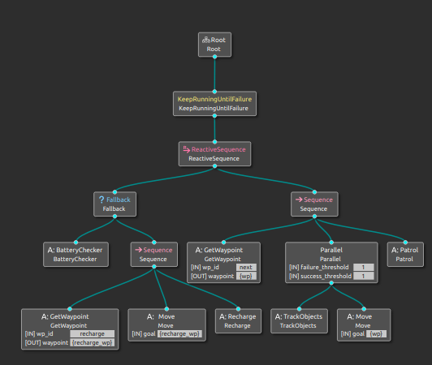

  <h1 align="center">PATROLLING DIFFERENTIAL DRIVE ROBOT</h1>

Made to be used with this [Project](https://github.com/Nil69420/Differential-Drive-Robot-Path-Planning-Using-ROS2-Nav2-Gazebo)

  

* Behavior Tree Action Nodes made and monitored using Groot; tested and executed using Tiago robot.